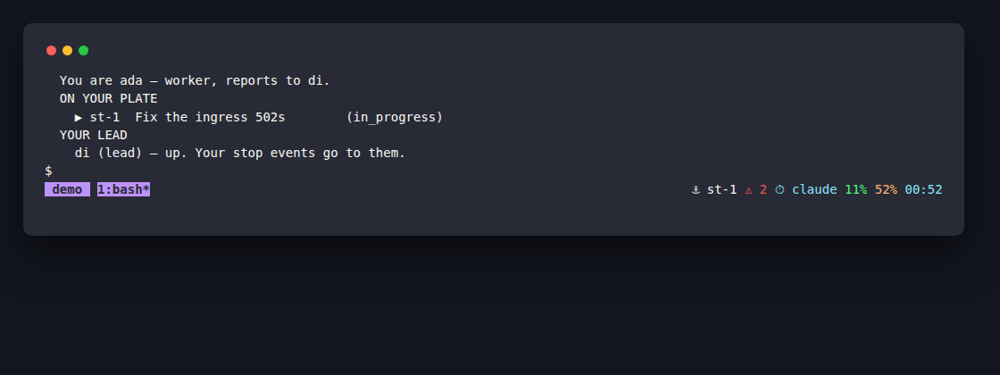

<p align="center">
  
</p>

<h1 align="center">shanty</h1>

<p align="center">
  <em>🛖 A tmux wrapper that makes the terminal feel like home</em>
</p>

<p align="center">
  <a href="LICENSE"></a>
  <a href="https://go.dev"></a>
  <a href="https://draculatheme.com/"></a>
  <a href="docs/src/SUMMARY.md"></a>
</p>

**Byobu's ergonomics, rebuilt as a single Go binary.** Dracula theme, `ctrl-a` prefix,
F-key bindings, and a status bar built from pluggable segments — with zero configuration
and no shell scripts anywhere.

> *tmux gives you a workshop full of tools. Shanty gives you a place to live in it.* 🏚️

<p align="center">
  
</p>

<p align="center">
  <em>Shanty's status bar with the optional <a href="https://github.com/scbrown/shantytown">shantytown</a> segments —
  ⚓ the work item this agent holds, ⚠ undelivered stop events, ⏱ its harness — beside the usual CPU, memory and clock.</em>
</p>

## See It In Action

```text
$ shanty
# ... tmux opens on its own socket, fully themed:

 main ──────────────────────────────────────────── 3% 42% dev-box 14:32
```

```text
$ shanty -s work          # named session
$ shanty -s monitoring    # another one

$ shanty ls
main
work
monitoring

# With shantytown (st) installed, `shanty ls` becomes a crew selector — each row
# is name + state (busy/idle/waiting/saturated, st's own verdict) + current item
# + settings currency, with the ones needing attention (blocked/waiting) first.
# Without st, or with --plain, it stays the plain name list above.

$ shanty attach work
# ... config is regenerated and sourced, then you attach
```

```text
$ shanty seg list
session
clock
host
cpu
mem
load
disk
anchor
crew
events
inbox
harness

$ shanty seg cpu
#[fg=#50fa7b]3%#[default]

$ shanty seg mem
#[fg=#ffb86c]67%#[default]

$ shanty seg disk
#[fg=#ff5555]84%#[default]
```

Segments print tmux format strings, so the status bar colors itself:
green under 50%, orange from 50–79%, red at 80% and above. (The last five in that
list are [shantytown](https://github.com/scbrown/shantytown) segments — see
[below](#shantytown-segments).)

## Why Shanty?

|  | **raw tmux** | **byobu** | **tmuxinator** | **oh-my-tmux** | **Shanty** |
|--|:------------:|:---------:|:--------------:|:--------------:|:----------:|
| Good-looking out of the box     | ❌ | ✅ | ❌ | ✅ | ✅ |
| Curated color palette (Dracula) | ❌ | ❌ | ❌ | ❌ | ✅ |
| `ctrl-a` prefix by default      | ❌ | ✅ | ❌ | ✅ | ✅ |
| Byobu-style F-key bindings      | ❌ | ✅ | ❌ | ❌ | ✅ |
| Modular status bar segments     | ❌ | ✅ | ❌ | ✅ | ✅ |
| Segments compiled in — no shell scripts | ❌ | ❌ | ❌ | ❌ | ✅ |
| No shell / Ruby runtime to install | ✅ | ❌ | ❌ | ❌ | ✅ |
| Isolated tmux server by default | ❌ | ✅ | ❌ | ❌ | ✅ |
| Themes as plain TOML            | ❌ | ❌ | ❌ | ❌ | ✅ |
| Config re-applied on every attach | ❌ | ❌ | ❌ | ❌ | ✅ |
| Per-project window layouts      | ❌ | ❌ | ✅ | ❌ | ❌ |

tmux is powerful but demands a config file before it feels good. byobu solved that
years ago — but it is a pile of shell and Python scripts that are awkward to extend.
Shanty's thesis: **keep byobu's defaults, throw away the scripts, ship one binary.**

Shanty deliberately does *not* do project layouts — if you want scripted window
arrangements, tmuxinator is the right tool and the two compose fine.

## Features

🎨 **Dracula Everywhere** — Pane borders, status bar, message prompts, and segment
colors all come from one palette. No 200-line `.tmux.conf` full of hex codes.

🔑 **Byobu Keybindings** — `ctrl-a` prefix instead of `ctrl-b`, plus F2–F8 function
keys that work with no prefix at all: new window, prev/next, reload, detach,
scrollback, rename. `ctrl-a ctrl-a` jumps to the last window, screen-style.

📊 **Pluggable Status Segments** — The status bar is a list of names. tmux calls
`shanty seg <name>` every 5 seconds and the same binary renders it. Adding one is a
Go type with two methods and a line in the registry — no shell, no `awk`.

🧩 **Seven System Segments Included** — `session`, `clock`, `host`, `cpu`, `mem`,
`load`, `disk`. The resource segments read `/proc` directly and color-code themselves
against green/orange/red thresholds.

🔌 **Session Isolation** — Shanty runs on its own tmux socket (`-L shanty`) with its
own server and config. It cannot clobber, and cannot be clobbered by, the tmux
sessions you already have open.

⚡ **Zero Config, Single Binary** — No config file to write, no plugin manager, no
runtime beyond tmux itself. Install the binary, run `shanty`, done.

🔁 **Live Config Regeneration** — The tmux config is generated on every launch *and*
every attach, then sourced. Edit your theme, re-attach, see it — no server restart.

🌈 **Custom Themes in TOML** — Drop eight hex values in
`~/.config/shanty/themes/dracula.toml` and the whole UI follows. Catppuccin, Nord,
Gruvbox — all one small file.

🚦 **Agent-Fleet Segments** — Optional segments for
[shantytown](https://github.com/scbrown/shantytown), the multi-agent workspace manager:
your current plate item, how many workers are busy, stop events waiting on you,
unread messages, and which harness you're running on. They need shantytown's `st`
CLI on your `PATH` and render empty without it — and they stay hidden until they
have something to say.

🐢 **Cheap by Default** — Segments that shell out to external tools share a 30-second
cache, so a 5-second status interval never turns into a fork bomb.

## Quick Start

**1. Install**

```bash
go install github.com/scbrown/shanty/cmd/shanty@latest
```

**2. Run**

```bash
shanty                  # launch or attach to the default session
shanty -s work          # a named session
shanty ls               # list sessions — a crew selector when shantytown is present
shanty ls --plain       # plain name list only (for scripting)
shanty attach work      # attach to one by name
```

That's it — Dracula theme, byobu keybindings, and a live status bar, with nothing
to configure.

## Installation

### From source (go install)

```bash
go install github.com/scbrown/shanty/cmd/shanty@latest
```

The binary lands in `$GOPATH/bin` (usually `~/go/bin`) — make sure that's on your `PATH`.

### Build from a clone

Requires Go 1.24+ and tmux.

```bash
git clone https://github.com/scbrown/shanty.git
cd shanty
just build      # or: go build -o shanty ./cmd/shanty
just install    # copies the binary to ~/.local/bin
```

### Binary releases

Pre-built binaries for Linux and macOS (amd64 and arm64) are on the
[Releases](https://github.com/scbrown/shanty/releases) page.

### Runtime dependency

**tmux** — `apt install tmux`, `brew install tmux`, or `pacman -S tmux`.

## Keybindings

Function keys work with no prefix:

| Key | Action |
|-----|--------|
| **F2** | New window |
| **F3** | Previous window |
| **F4** | Next window |
| **F5** | Reload config |
| **F6** | Detach |
| **F7** | Scrollback / copy mode |
| **F8** | Rename window |

The prefix is **ctrl-a**:

| Key | Action |
|-----|--------|
| **ctrl-a \|** | Split vertically |
| **ctrl-a -** | Split horizontally |
| **ctrl-a** *arrow* | Move between panes |
| **ctrl-a a** / **ctrl-a ctrl-a** | Last window |

All standard tmux bindings still work under `ctrl-a`.

## Status Bar

Default layout — left: `session`; right: `cpu`, `mem`, `host`, `clock`.

| Segment | Description | Example |
|---------|-------------|---------|
| `session` | Current session name | `main` |
| `clock` | Current time (HH:MM) | `14:32` |
| `host` | Hostname | `dev-box` |
| `cpu` | CPU usage, color-coded (samples `/proc/stat`) | `3%` |
| `mem` | Memory usage, color-coded | `42%` |
| `load` | 1-minute load average | `0.5` |
| `disk` | Root partition usage | `61%` |

Color coding: green (<50%), orange (50–79%), red (80%+).

### shantytown segments

Five further segments surface state from
[shantytown](https://github.com/scbrown/shantytown), a multi-agent workspace manager.
They shell out to shantytown's `st` CLI.

| Segment | Description | Example |
|---------|-------------|---------|
| `anchor` | Current plate item | `⚓ st-1` |
| `crew` | Busy / total workers | `⚙ 3/9` |
| `events` | Undelivered stop events for you | `⚠ 2` |
| `inbox` | Unread messages | `✉ 1` |
| `harness` | Agent runtime backing you | `⏱ claude` |

**These five require the `st` CLI on your `PATH`** and render as an empty string
without it — so they cost nothing, and show nothing, if you don't use shantytown.
Each also hides itself when the answer is nothing — empty plate, no judgeable crew,
zero events, no unread mail — so the bar lights up only when something wants you.
Every one except `crew` is per-agent and takes its identity from `$SHANTY_AGENT`;
with that unset they render empty rather than guess. Their results are cached for
30 seconds.

```bash
shanty seg list    # show every available segment
shanty seg cpu     # render one segment (handy for testing)
```

## Theme

| Element | Color | Hex |
|---------|-------|-----|
| Background | Dark | `#282a36` |
| Foreground | Light | `#f8f8f2` |
| Status bar | Grey | `#44475a` |
| Highlights | Purple | `#bd93f9` |
| Active pane border | Green | `#50fa7b` |
| Inactive pane border | Comment | `#6272a4` |
| Alerts | Red | `#ff5555` |
| Warnings | Orange | `#ffb86c` |

### Custom themes

Place a TOML file at `~/.config/shanty/themes/dracula.toml`:

```toml
name = "my-theme"

bg              = "#1e1e2e"
fg              = "#cdd6f4"
status_bg       = "#313244"
highlight       = "#cba6f7"
active_border   = "#a6e3a1"
inactive_border = "#585b70"
alert           = "#f38ba8"
warning         = "#fab387"
```

All eight fields are required and must be `#rrggbb` hex.

## Architecture

```text
cmd/shanty/         Entry point (main.go)
internal/
  cmd/              Cobra CLI commands (root, ls, attach, seg)
  config/           Theme loading, keybindings, status bar layout
  session/          tmux session management and config generation
  segments/         Pluggable status bar segment implementations
themes/             Theme definitions (TOML)
```

Running `shanty` generates a tmux config at `~/.config/shanty/tmux.conf` — theme,
keybindings, and status bar — then starts or attaches to a session on the dedicated
`shanty` socket. Status bar entries are `#(shanty seg <name>)` calls back into the
same binary, which keeps segment logic in Go while tmux owns the refresh lifecycle.

## Dependencies

Minimal by design:

- [cobra](https://github.com/spf13/cobra) — CLI framework
- [BurntSushi/toml](https://github.com/BurntSushi/toml) — theme file parsing

Runtime: **tmux**.

## Development

```bash
just build      # build the binary
just test       # go test ./...
just lint       # go vet ./...
just fmt        # gofmt -s -w .
just check      # fmt-check + lint + test
```

## Documentation

- [Introduction](docs/src/intro.md)
- [Installation](docs/src/installation.md)
- [Configuration](docs/src/configuration.md)
- [Keybindings](docs/src/keybindings.md)
- [Themes](docs/src/themes.md)
- [Status Bar Segments](docs/src/segments.md)
- [Architecture](docs/src/architecture.md)

## License

[MIT](LICENSE)
