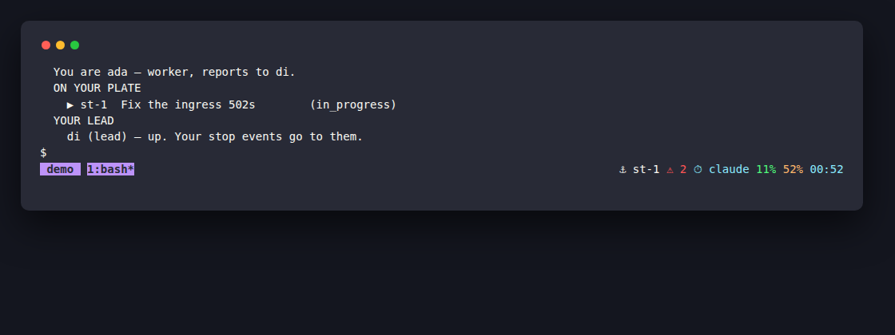

<p align="center">
  
</p>

<h1 align="center">shanty</h1>

<p align="center">
  <em>🛖 A tmux wrapper that makes the terminal feel like home</em>
</p>

<p align="center">
  <a href="LICENSE"></a>
  <a href="https://go.dev"></a>
  <a href="https://draculatheme.com/"></a>
  <a href="docs/src/SUMMARY.md"></a>
</p>

**Byobu's ergonomics, rebuilt as a single Go binary.** Dracula theme, `ctrl-a` prefix,
F-key bindings, and a status bar built from pluggable segments — with zero configuration
and no shell scripts anywhere.

> *tmux gives you a workshop full of tools. Shanty gives you a place to live in it.* 🏚️

<p align="center">
  
</p>

<p align="center">
  <em>Shanty's status bar with the optional <a href="https://github.com/scbrown/shantytown">shantytown</a> segments —
  ⚓ the work item this agent holds, ⚠ undelivered stop events, ⏱ its harness — beside the usual CPU, memory and clock.</em>
</p>

## See It In Action

```text
$ shanty
# ... tmux opens on its own socket, fully themed:

 main ──────────────────────────────────────────── 3% 42% dev-box 14:32
```

```text
$ shanty -s work          # named session
$ shanty -s monitoring    # another one

$ shanty ls
main
work
monitoring

# With shantytown (st) installed, `shanty ls` becomes a crew selector — each row
# is name + state (busy/idle/waiting/saturated, st's own verdict) + current item
# + settings currency, with the ones needing attention (blocked/waiting) first.
# Without st, or with --plain, it stays the plain name list above.

$ shanty attach work
# ... config is regenerated and sourced, then you attach
```

```text
$ shanty seg list
session
clock
host
cpu
mem
load
disk
crewid
task
stats
anchor
crew
events
inbox
harness

$ shanty seg cpu
#[fg=#50fa7b]3%#[default]

$ shanty seg mem
#[fg=#ffb86c]67%#[default]

$ shanty seg disk
#[fg=#ff5555]84%#[default]
```

Segments print tmux format strings, so the status bar colors itself:
green under 50%, orange from 50–79%, red at 80% and above. (The last eight in that
list are [shantytown](https://github.com/scbrown/shantytown) segments — see
[below](#shantytown-segments).)

## Why Shanty?

|  | **raw tmux** | **byobu** | **tmuxinator** | **oh-my-tmux** | **Shanty** |
|--|:------------:|:---------:|:--------------:|:--------------:|:----------:|
| Good-looking out of the box     | ❌ | ✅ | ❌ | ✅ | ✅ |
| Curated color palette (Dracula) | ❌ | ❌ | ❌ | ❌ | ✅ |
| `ctrl-a` prefix by default      | ❌ | ✅ | ❌ | ✅ | ✅ |
| Byobu-style F-key bindings      | ❌ | ✅ | ❌ | ❌ | ✅ |
| Modular status bar segments     | ❌ | ✅ | ❌ | ✅ | ✅ |
| Segments compiled in — no shell scripts | ❌ | ❌ | ❌ | ❌ | ✅ |
| No shell / Ruby runtime to install | ✅ | ❌ | ❌ | ❌ | ✅ |
| Isolated tmux server by default | ❌ | ✅ | ❌ | ❌ | ✅ |
| Themes as plain TOML            | ❌ | ❌ | ❌ | ❌ | ✅ |
| Config re-applied on every attach | ❌ | ❌ | ❌ | ❌ | ✅ |
| Per-project window layouts      | ❌ | ❌ | ✅ | ❌ | ❌ |

tmux is powerful but demands a config file before it feels good. byobu solved that
years ago — but it is a pile of shell and Python scripts that are awkward to extend.
Shanty's thesis: **keep byobu's defaults, throw away the scripts, ship one binary.**

Shanty deliberately does *not* do project layouts — if you want scripted window
arrangements, tmuxinator is the right tool and the two compose fine.

## Features

🎨 **Dracula Everywhere** — Pane borders, status bar, message prompts, and segment
colors all come from one palette. No 200-line `.tmux.conf` full of hex codes.

🔑 **Byobu Keybindings** — `ctrl-a` prefix instead of `ctrl-b`, plus F2–F8 function
keys that work with no prefix at all: new window, prev/next, reload, detach,
scrollback, rename. `ctrl-a ctrl-a` jumps to the last window, screen-style.

📊 **Pluggable Status Segments** — The status bar is a list of names. tmux calls
`shanty seg <name>` every 5 seconds and the same binary renders it. Adding one is a
Go type with two methods and a line in the registry — no shell, no `awk`.

🧩 **Seven System Segments Included** — `session`, `clock`, `host`, `cpu`, `mem`,
`load`, `disk`. The resource segments read `/proc` directly and color-code themselves
against green/orange/red thresholds.

🔌 **Session Isolation** — Shanty runs on its own tmux socket (`-L shanty`) with its
own server and config. It cannot clobber, and cannot be clobbered by, the tmux
sessions you already have open.

⚡ **Zero Config, Single Binary** — No config file to write, no plugin manager, no
runtime beyond tmux itself. Install the binary, run `shanty`, done.

🔁 **Live Config Regeneration** — The tmux config is generated on every launch *and*
every attach, then sourced. Edit your theme, re-attach, see it — no server restart.

🌈 **Custom Themes in TOML** — Drop eight hex values in
`~/.config/shanty/themes/dracula.toml` and the whole UI follows. Catppuccin, Nord,
Gruvbox — all one small file.

🚦 **Agent-Fleet Segments** — Optional segments for
[shantytown](https://github.com/scbrown/shantytown), the multi-agent workspace manager:
who this pane belongs to and what state they are in, the item they hold and its
title, what they have actually been doing, how many workers are busy, stop events
waiting on you, unread messages, and which harness you're running on.

🐾 **A Mark Per Crew Member** — Each agent gets one emoji, assigned on first sight
and never reassigned, so a wall of a dozen panes is identifiable without reading a
word. `shanty marks` shows the roster; the registry is a TOML file you can edit.

🔊 **Broken Never Looks Fine** — A status segment that blanks when it breaks reads
as "nothing to report", so it gets believed. These render empty only when the `st`
CLI is absent entirely. With it present, anything they cannot answer — an
unresolvable identity, a failing call, a plate that will not name an item for an
agent st calls busy — renders a visible ⚠ instead.

🐢 **Cheap by Default** — Every `#(shanty seg …)` is its own process, so segments
that shell out share an on-disk answer cache and a 5-second status interval never
turns into a fork bomb.

## Quick Start

**1. Install**

```bash
go install github.com/scbrown/shanty/cmd/shanty@latest
```

**2. Run**

```bash
shanty                  # launch or attach to the default session
shanty -s work          # a named session
shanty ls               # list sessions — a crew selector when shantytown is present
shanty ls --plain       # plain name list only (for scripting)
shanty attach work      # attach to one by name
```

That's it — Dracula theme, byobu keybindings, and a live status bar, with nothing
to configure.

## Installation

### From source (go install)

```bash
go install github.com/scbrown/shanty/cmd/shanty@latest
```

The binary lands in `$GOPATH/bin` (usually `~/go/bin`) — make sure that's on your `PATH`.

### Build from a clone

Requires Go 1.24+ and tmux.

```bash
git clone https://github.com/scbrown/shanty.git
cd shanty
just build      # or: go build -o shanty ./cmd/shanty
just install    # copies the binary to ~/.local/bin
```

### Binary releases

Pre-built binaries for Linux and macOS (amd64 and arm64) are on the
[Releases](https://github.com/scbrown/shanty/releases) page.

### Runtime dependency

**tmux** — `apt install tmux`, `brew install tmux`, or `pacman -S tmux`.

## Keybindings

Function keys work with no prefix:

| Key | Action |
|-----|--------|
| **F2** | New window |
| **F3** | Previous window |
| **F4** | Next window |
| **F5** | Reload config |
| **F6** | Detach |
| **F7** | Scrollback / copy mode |
| **F8** | Rename window |

The prefix is **ctrl-a**:

| Key | Action |
|-----|--------|
| **ctrl-a \|** | Split vertically |
| **ctrl-a -** | Split horizontally |
| **ctrl-a** *arrow* | Move between panes |
| **ctrl-a a** / **ctrl-a ctrl-a** | Last window |
| **ctrl-a s** | Fuzzy session switcher |

All standard tmux bindings still work under `ctrl-a`.

### Session switcher

`ctrl-a s` opens a fuzzy switcher in a popup rather than tmux's `choose-tree`.
Type to filter as soon as it opens, and the session you last switched *away
from* sits at the top under the cursor — so **ctrl-a s Enter** toggles back to
it. Below that, sessions are ordered by when you were last in them. The session
you are currently in is not offered.

Ordering comes from tmux's `session_last_attached` — when you were last *in* a
session — not `choose-tree -O time`, which sorts by *activity* and so ranks
whichever session most recently printed output.

Uses [fzf](https://github.com/junegunn/fzf) for matching; without it `ctrl-a s`
falls back to tmux's standard session tree. `shanty pick --list` prints the
ordering without switching.

## Status Bar

Default layout — left: `session`; right: `cpu`, `mem`, `host`, `clock`.

| Segment | Description | Example |
|---------|-------------|---------|
| `session` | Current session name | `main` |
| `clock` | Current time (HH:MM) | `14:32` |
| `host` | Hostname | `dev-box` |
| `cpu` | CPU usage, color-coded (samples `/proc/stat`) | `3%` |
| `mem` | Memory usage, color-coded | `42%` |
| `load` | 1-minute load average | `0.5` |
| `disk` | Root partition usage | `61%` |

Color coding: green (<50%), orange (50–79%), red (80%+).

### shantytown segments

Eight further segments surface state from
[shantytown](https://github.com/scbrown/shantytown), a multi-agent workspace manager.
They shell out to shantytown's `st` CLI.

| Segment | Description | Example |
|---------|-------------|---------|
| `crewid` | Who this pane is: mark, name, role, state | `🦊 bond·wkr busy` |
| `task` | The item held, with its title | `⚓ ss-1 rework the cache` |
| `stats` | Activity, files touched, token traffic | `Σ 412⚡ 17f 222ktok` |
| `crew` | Busy / total workers | `⚙ 3/9` |
| `events` | Undelivered stop events for you | `⚠ 2` |
| `inbox` | Unread messages | `✉ 1` |
| `harness` | Agent runtime backing you | `⏱ claude` |
| `anchor` | The held item's id alone (superseded by `task`) | `⚓ ss-1` |

**These require the `st` CLI** and render as an empty string when no `st` binary
exists at all — so they cost nothing, and show nothing, if you don't use
shantytown. That is the ONLY case in which they go quiet. When `st` is present they
are loud about anything they cannot answer, because a bar that blanks on failure
looks healthy:

| Situation | Rendering |
|-----------|-----------|
| Agent holds an item | `⚓ ss-1 rework the cache` |
| Agent is idle, plate empty | `⚓ — nothing held` |
| `st` calls the agent busy but names no item | `⚓ ⚠ busy, no item` |
| No identity derivable | `⚠ no agent` |
| The `st` call failed | `⚠ st?` |
| No capture store behind `st stats` | `Σ off` |

Every segment except `crew` is per-agent. Identity comes from `$SHANTY_AGENT`, and
otherwise from the session name (`shanty-<agent>` or shantytown's `st-<agent>`) —
which is what the bar normally uses, because tmux runs status commands from the
tmux **server's** environment, not the pane's. Reads are non-marking: the bar polls
`inbox --count` and `anchor --events`, which shantytown documents as reads that
consume nothing.

Three environment variables tune the integration:

| Variable | Effect |
|----------|--------|
| `SHANTY_ST_BIN` | The `st` binary to use. Default: `PATH`, then `~/.local/bin`, `/usr/local/bin`, `/opt/homebrew/bin`, `/usr/bin`. |
| `SHANTY_ST_CWD` | The directory to run `st` from. `st` resolves its tracker by walking up from here, so this decides which store the bar reads. |
| `SHANTY_SEG_NOCACHE` | Disable the shared on-disk answer cache. |

### Crew marks

```bash
shanty marks       # who is badged with what
```

Marks are assigned on first sight and never reassigned — a mark that moves when the
roster changes destroys the recognition it exists to provide, which is why the
assignment is stored in `~/.config/shanty/agents.toml` rather than derived from a
hash. Edit a line to choose your own; assignment will not overwrite it. `shanty
apply` assigns marks for the whole roster in one deterministic pass.

```bash
shanty seg list    # show every available segment
shanty seg cpu     # render one segment (handy for testing)
```

## Theme

| Element | Color | Hex |
|---------|-------|-----|
| Background | Dark | `#282a36` |
| Foreground | Light | `#f8f8f2` |
| Status bar | Grey | `#44475a` |
| Highlights | Purple | `#bd93f9` |
| Active pane border | Green | `#50fa7b` |
| Inactive pane border | Comment | `#6272a4` |
| Alerts | Red | `#ff5555` |
| Warnings | Orange | `#ffb86c` |

### Custom themes

Place a TOML file at `~/.config/shanty/themes/dracula.toml`:

```toml
name = "my-theme"

bg              = "#1e1e2e"
fg              = "#cdd6f4"
status_bg       = "#313244"
highlight       = "#cba6f7"
active_border   = "#a6e3a1"
inactive_border = "#585b70"
alert           = "#f38ba8"
warning         = "#fab387"
```

All eight fields are required and must be `#rrggbb` hex.

## Architecture

```text
cmd/shanty/         Entry point (main.go)
internal/
  cmd/              Cobra CLI commands (root, ls, attach, seg, apply, marks)
  config/           Theme loading, keybindings, status bar layout
  session/          tmux session management and config generation
  segments/         Pluggable status bar segment implementations
  stread/           The one reader for shantytown's st CLI (locate, run, cache, parse)
  crewid/           Per-agent emoji marks: assign once, never reassign
themes/             Theme definitions (TOML)
```

Running `shanty` generates a tmux config at `~/.config/shanty/tmux.conf` — theme,
keybindings, and status bar — then starts or attaches to a session on the dedicated
`shanty` socket. Status bar entries are `#(<abs-path-to-shanty> seg <name>)` calls
back into the same binary, which keeps segment logic in Go while tmux owns the
refresh lifecycle. The path is absolute deliberately: tmux runs status commands from
the server's environment, whose `PATH` may not include shanty, and a bar that cannot
exec its own segments renders as a blank line rather than an error.

## Dependencies

Minimal by design:

- [cobra](https://github.com/spf13/cobra) — CLI framework
- [BurntSushi/toml](https://github.com/BurntSushi/toml) — theme file parsing

Runtime: **tmux**.

## Development

```bash
just build      # build the binary
just test       # go test ./...
just lint       # go vet ./...
just fmt        # gofmt -s -w .
just check      # fmt-check + lint + test
```

## Documentation

- [Introduction](docs/src/intro.md)
- [Installation](docs/src/installation.md)
- [Configuration](docs/src/configuration.md)
- [Keybindings](docs/src/keybindings.md)
- [Themes](docs/src/themes.md)
- [Status Bar Segments](docs/src/segments.md)
- [Architecture](docs/src/architecture.md)

## License

[MIT](LICENSE)
